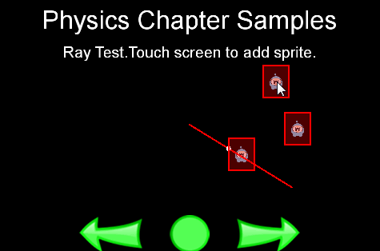
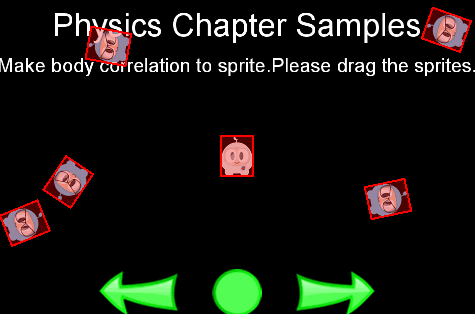
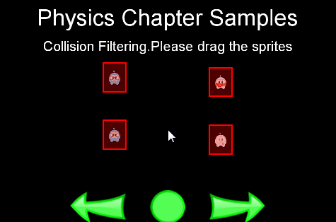
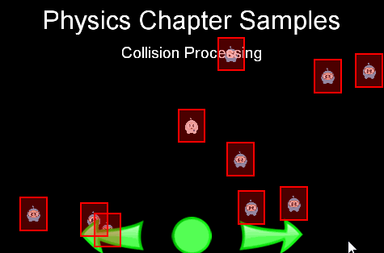

# Chapter 12: Physics

------
## What options and why integrated physics engine
Simulate real physical world in game is annoying, so usually game physics engine take charge of this kind of stuff. As known, **Box2D** can simulate almost all the physical effect. However, **Chipmunk** is more light-weight. 

In Cocos2d-x 2.x, you can uses physics engine directly. In addition,**Cocos2d-x** provide `CCPhysicsSprite` to resolve the relationship between physics engine's body and `CCSprite`, but other elements of physics engine didn't connect to Cocos2d-x. In this way you should call the APIs of Chipmunk or Box2D in game to solve the logical stuff. Using physics engine directly in game is complex, you need to be familiar with Cocos2d-x and physical engine.

Things have been changed in Cocos2d-x 3.0, we have deep integration of Chipmunk to help with simulate real physical world in game. It makes the usage more easier. 

------
## Physics concepts
### Bodies
A body holds the physical properties of an object. (mass,position,rotation,velocity,damping,etc.) Bodies are the backbone for shapes.It does not have a shape until you attach one or more collision shapes to it.

----------
### Material
Materials describe material attributes：
 >- density：It is used to compute the mass properties of the parent body.
 >- friction：It is used to make objects slide along each other realistically.
 >- restitution：It is used to make objects bounce. The restitution value is usually set to be between 0 and 1.

----------
### Shapes
Shapes describe collision geometry.By attaching shapes to bodies, you can define a body’s shape.You can attach as many shapes to a single body as you need to in order to define a complex shape.Each shape related to a `PhysicsMaterial` object and contains the flollowing attributes: type,area,moment,tag,mass and offset.

 >- `PhysicsShape`:Shapes implement the `PhysicsShape` base class.
 >- `PhysicsShapeCircle`:Circles are solid. You cannot make a hollow circle using the circle shape.
 >- `PhysicsShapePolygon`:Polygon shapes are solid convex polygons.
 >- `PhysicsShapeBox`:A Box shape is one kind of convex polygon.
 >- `PhysicsShapeEdgeSegment`:A segment shape.
 >- `PhysicsShapeEdgePolygon`:Hollow polygon shapes.A edge-polygon shape consists of multiple segment shapes.
 >- `PhysicsShapeEdgeBox`：Hollow box shapes.A edge-box shape consists of four segment shapes.
 >- `PhysicsShapeEdgeChain`:The chain shape provides an efficient way to connect many edges together. 

----------
### Contacts/Joints
Constraints and joints describe how bodies are attached to each other.

----------
### World
World containers for simulating objects in Cocos2d-x. You add bodies, shapes and constraints to a world and then update the world as a whole. They control how all the bodies, shapes, and constraints interact together. Much of your interactions with the physics mode of Cocos2d-x will be with a `PhysicsWorld` object.

----------
## Physics world, bodies
### PhysicsWorld
Cocos2d-x provide `PhysicsWorld` as the basic unit of simulation. Physics world integrated into `Scene` and auto step physics world forward through main loop of Cocos2d-x. You can create a scene with physics world:

```cpp
auto scene = Scene::createWithPhysics();
```

Properties:
 >- gravity:Global gravity applied to the world. Defaults to Vec2(0.0f, -98.0f).
 >- speed:Set the speed of physics world, speed is the rate at which the simulation executes. Defaults to 1.0.
 >- updateRate:set the update rate of physics world, update rate is the value of EngineUpdateTimes/PhysicsWorldUpdateTimes.
 >- substeps:set the number of substeps in an update of the physics world.

You can disable auto step of physics world by `PhysicsWorld::setAutoStep(false)` and step physics world manually by `PhysicsWorld::step(time)`.

#### Helper Functions
```cpp
    /** Get physics shapes that contains the point. */
    Vector<PhysicsShape*> getShapes(const Vec2& point) const;

    /** return physics shape that contains the point. */
    PhysicsShape* getShape(const Vec2& point) const;

    /** Get all the bodys that in the physics world. */
    const Vector<PhysicsBody*>& getAllBodies() const;

    /** Get body by tag */
    PhysicsBody* getBody(int tag) const;

    /** set the debug draw mask */
    void setDebugDrawMask(int mask);
```

#### Queries
`PhysicsWorld` support three kinds of spatial queries.

##### 1.Point Queries:
Point queries are useful for things like mouse picking and simple sensors. They allow you to check if there are shapes within a certain distance of a point, find the closest point on a shape to a given point or find the closest shape to a point.

##### 2.Ray Cast:
You can cast a ray at a shape to get the point of first intersection and normal vector.

```cpp
typedef struct PhysicsRayCastInfo
{
    //The shape that was hit
    PhysicsShape* shape;
    //start point of segment query
    Vec2 start;
    //end point of segment query
    Vec2 end;
    //the point of first intersection
    Vec2 contact;
    //the normal of the surface hit
    Vect normal;
    //The normalized distance along the query segment in the range [0, 1].
    float fraction;
    //user data
    void* data;
}PhysicsRayCastInfo;

```
For example:
```cpp
void PhysicsDemoRayTest::tick(float dt)
{
    Vec2 d(300 * cosf(_angle), 300 * sinf(_angle));
    Vec2 point2 = s_centre + d;
    if (_drawNode)
    {
        removeChild(_drawNode);
    }
    _drawNode = DrawNode::create();

#define MAX_MULTI_RAYCAST_NUM 5

    Vec2 points[MAX_MULTI_RAYCAST_NUM];
    int num = 0;
    PhysicsRayCastCallbackFunc func = [&points, &num](PhysicsWorld& world, const PhysicsRayCastInfo& info, void* data)->bool
    {
        if (num < MAX_MULTI_RAYCAST_NUM)
        {
            points[num++] = info.contact;
        }
        return true;
    };

    s_currScene->getPhysicsWorld()->rayCast(func, s_centre, point2, nullptr);

    _drawNode->drawSegment(s_centre, point2, 1, Color4F::RED);
    for (int i = 0; i < num; ++i)
    {
        _drawNode->drawDot(points[i], 3, Color4F(1.0f, 1.0f, 1.0f, 1.0f));
    }
    addChild(_drawNode);

    _angle += 1.5f * (float)M_PI / 180.0f;
}
```



##### 3.Rect Queries:
Rect queries give you a fast way to check roughly which shapes are in an area.

```cpp
PhysicsQueryRectCallbackFunc func = [](PhysicsWorld& world, PhysicsShape& shape, void* userData)->bool
{
    //Return true from the callback to continue rect queries
    return true;
}

scene->>getPhysicsWorld()->queryRect(func,Rect(0,0,200,200),nullptr);
```

----------
### PhysicsBody
Bodies have position and velocity. You can apply forces, moment,damping and impulses to bodies. Bodies can be static or dynamic. A static body does not move under simulation and behaves as if it has infinite mass. A dynamic body is fully simulated. They can be moved manually by the user, but normally they move according to forces. A dynamic body can collide with all body types.Cocos2d-x provide `Node::setPhysicsBody()` to make `PhysicsBody` associated with sprite.

```cpp
//create a static PhysicsBody contains a box shape
auto physicsBody = PhysicsBody::createBox(Size(65.0f, 81.0f),PhysicsMaterial(0.1f, 1.0f, 0.0f));
physicsBody->setDynamic(false);

//create a sprite
auto sprite = Sprite::create("whiteSprite.png");
sprite->setPosition(s_centre);
addChild(sprite);

//make physicsBody associated with sprite
sprite->setPhysicsBody(physicsBody);

//add five dynamic body
for (int i = 0; i < 5; ++i)
{
    physicsBody = PhysicsBody::createBox(Size(65.0f, 81.0f),PhysicsMaterial(0.1f, 1.0f, 0.0f));
    //set the body isn't affected by the physics world's gravitational force
    physicsBody->setGravityEnable(false);
    //set initial velocity of physicsBody
    physicsBody->setVelocity(Vec2(cocos2d::random(-500,500),cocos2d::random(-500,500)));
    physicsBody->setTag(DRAG_BODYS_TAG);

    sprite = Sprite::create("blueSprite.png");
    sprite->setPosition(Vec2(s_centre.x + cocos2d::random(-300,300),s_centre.y + cocos2d::random(-300,300)));
    sprite->setPhysicsBody(physicsBody);
    addChild(sprite);
}
```



----------
## Collision 
### Filtering Collisions
Collision filtering allows you to prevent collision between shapes.Cocos2d-x supports such collision filtering using categories and groups.

Cocos2d-x supports 32 collision categories. For each shape you can specify which category it belongs to. You also specify what other categories this shape can collide with.This is done with masking bits.For example:
```cpp
    auto sprite1 = addSpriteAtPosition(Vec2(s_centre.x - 150,s_centre.y));
    sprite1->getPhysicsBody()->setCategoryBitmask(0x02);    // 0010
    sprite1->getPhysicsBody()->setCollisionBitmask(0x01);   // 0001

    sprite1 = addSpriteAtPosition(Vec2(s_centre.x - 150,s_centre.y + 100));
    sprite1->getPhysicsBody()->setCategoryBitmask(0x02);    // 0010
    sprite1->getPhysicsBody()->setCollisionBitmask(0x01);   // 0001

    auto sprite2 = addSpriteAtPosition(Vec2(s_centre.x + 150,s_centre.y),1);
    sprite2->getPhysicsBody()->setCategoryBitmask(0x01);    // 0001
    sprite2->getPhysicsBody()->setCollisionBitmask(0x02);   // 0010

    auto sprite3 = addSpriteAtPosition(Vec2(s_centre.x + 150,s_centre.y + 100),2);
    sprite3->getPhysicsBody()->setCategoryBitmask(0x03);    // 0011
    sprite3->getPhysicsBody()->setCollisionBitmask(0x03);   // 0011
```
Here is the rule for a collision to occur:
```cpp
    if ((shapeA->getCategoryBitmask() & shapeB->getCollisionBitmask()) == 0
        || (shapeB->getCategoryBitmask() & shapeA->getCollisionBitmask()) == 0)
    {
        //shapes can't collide
        ret = false;
    }
```



Collision groups let you specify an integral group index. You can have all shapes with the same group index always collide (positive index) or never collide (negative index and zero index). Collisions between shapes of different group indices are filtered according the category and mask bits. In other words, group filtering has higher precedence than category filtering.

----------
### Contacts/Joints
Each joint type has a definition that derives from `PhysicsJoint`. All joints are connected between two different bodies. One body may static.You can prevent the attached bodies from colliding with each other by `joint->setCollisionEnable(false)`. Many joint definitions require that you provide some geometric data. Often a joint will be defined by anchor points.The rest of the joint definition data depends on the joint type.

 >- PhysicsJointFixed: A fixed joint fuses the two bodies together at a reference point. Fixed joints are useful for creating complex shapes that can be broken apart later.
 >- PhysicsJointLimit: A limit joint imposes a maximum distance between the two bodies, as if they were connected by a rope.
 >- PhysicsJointPin: A pin joint allows the two bodies to independently rotate around the anchor point as if pinned together.
 >- PhysicsJointDistance: Set the fixed distance with two bodies
 >- PhysicsJointSpring: Connecting two physics bodies together with a spring
 >- PhysicsJointGroove: Attach body a to a line, and attach body b to a dot
 >- PhysicsJointRotarySpring: Likes a spring joint, but works with rotary
 >- PhysicsJointRotaryLimit: Likes a limit joint, but works with rotary
 >- PhysicsJointRatchet: Works like a socket wrench
 >- PhysicsJointGear: Keeps the angular velocity ratio of a pair of bodies constant
 >- PhysicsJointMotor: Keeps the relative angular velocity of a pair of bodies constant


----------
### Collision detection
Contacts are objects created by physics mode to manage collision between two shapes. The contact class is created and destroyed by physics mode. Contact objects are not created by the user. Here is some terminology associated with contacts.
 - contact point:A contact point is a point where two shapes touch.
 - contact normal:A contact normal is a unit vector that points from one shape to another. 

You can get the shapes from a contact. From those you can get the bodies.


```cpp
bool PhysicsContactTest::onContactBegin(PhysicsContact& contact)
{
    PhysicsBody* bodyA = contact.getShapeA()->getBody();
    PhysicsBody* bodyB = contact.getShapeB()->getBody();
    return true;
}
```
You can get access to contacts by implement a contact listener.The contact listener supports several events: begin, pre-solve, post-solve and seperate.

>- begin: Two shapes just started touching for the first time this step. Return true from the callback to process the collision normally or false to cause physics engine to ignore the collision entirely. If you return false, the preSolve() and postSolve() callbacks will never be run, but you will still recieve a separate event when the shapes stop overlapping.
 >- pre-solve: Two shapes are touching during this step. Return false from the callback to make physics engine ignore the collision this step or true to process it normally. Additionally, you may override collision values using setRestitution(), setFriction() or setSurfaceVelocity() to provide custom restitution,friction, or surface velocity values. 
 >- post-solve: Two shapes are touching and their collision response has been processed.
 >- seperate: Two shapes have just stopped touching for the first time this step.

You also can use EventListenerPhysicsContactWithBodies, EventListenerPhysicsContactWithShapes, EventListenerPhysicsContactWithGroup to listen the event you interested with bodys, shapes or group. But you also need to set the physics contact related bitmask value, because the contact event won't be received by default, even you create the relative EventListener.

For example:
```cpp
#define STATIC_SPRITE_TAG 10
bool PhysicsDemoCollisionProcessing::init()
{
    if (PhysicsDemo::init()) {
        //create a static PhysicsBody
        auto sprite = addSpriteAtPosition(s_centre,1);
        sprite->setTag(STATIC_SPRITE_TAG);
        sprite->getPhysicsBody()->setContactTestBitmask(0xFFFFFFFF);
        sprite->getPhysicsBody()->setDynamic(false);

        //adds contact event listener
        auto contactListener = EventListenerPhysicsContact::create();
        contactListener->onContactBegin = CC_CALLBACK_1(PhysicsDemoCollisionProcessing::onContactBegin, this);
        _eventDispatcher->addEventListenerWithSceneGraphPriority(contactListener, this);

        schedule(CC_SCHEDULE_SELECTOR(PhysicsDemoCollisionProcessing::tick), 0.3f);
        return true;
    }
    
    return false;
}

void PhysicsDemoCollisionProcessing::tick(float dt)
{
    auto sprite1 = addSpriteAtPosition(Vec2(s_centre.x + cocos2d::random(-300,300),s_centre.y + cocos2d::random(-300,300)));
    auto physicsBody = sprite1->getPhysicsBody();
    physicsBody->setVelocity(Vec2(cocos2d::random(-500,500),cocos2d::random(-500,500)));
    physicsBody->setContactTestBitmask(0xFFFFFFFF);
}

bool PhysicsDemoCollisionProcessing::onContactBegin(PhysicsContact& contact)
{
    auto nodeA = contact.getShapeA()->getBody()->getNode();
    auto nodeB = contact.getShapeB()->getBody()->getNode();
    if (nodeA && nodeB)
    {
        if (nodeA->getTag() == STATIC_SPRITE_TAG)
        {
            nodeB->removeFromParentAndCleanup(true);
        }
        else if (nodeB->getTag() == STATIC_SPRITE_TAG)
        {
            nodeA->removeFromParentAndCleanup(true);
        }
    }
    
    //bodies can collide
    return true;
}
```


