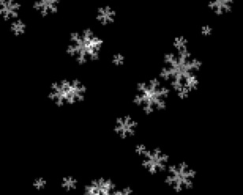
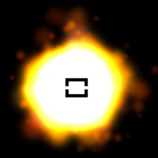
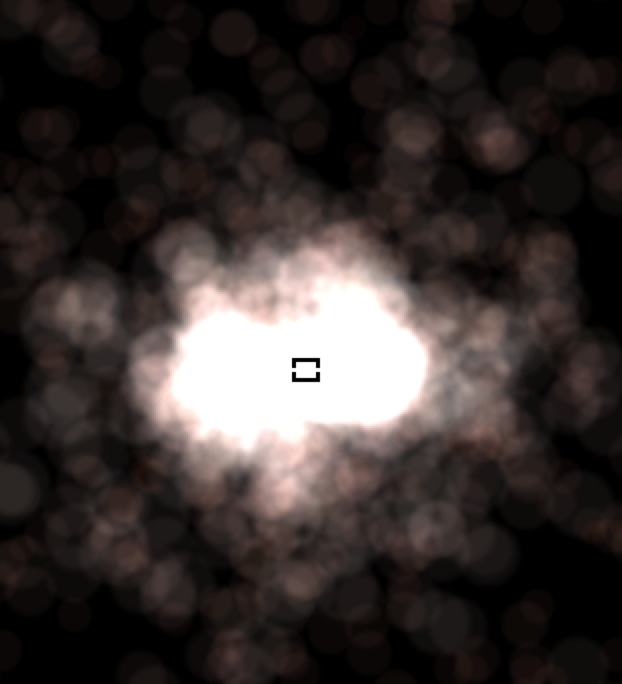
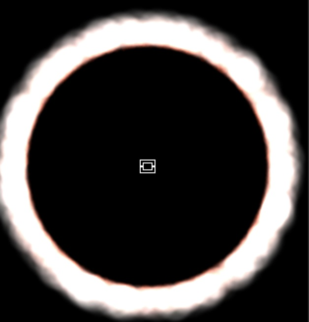
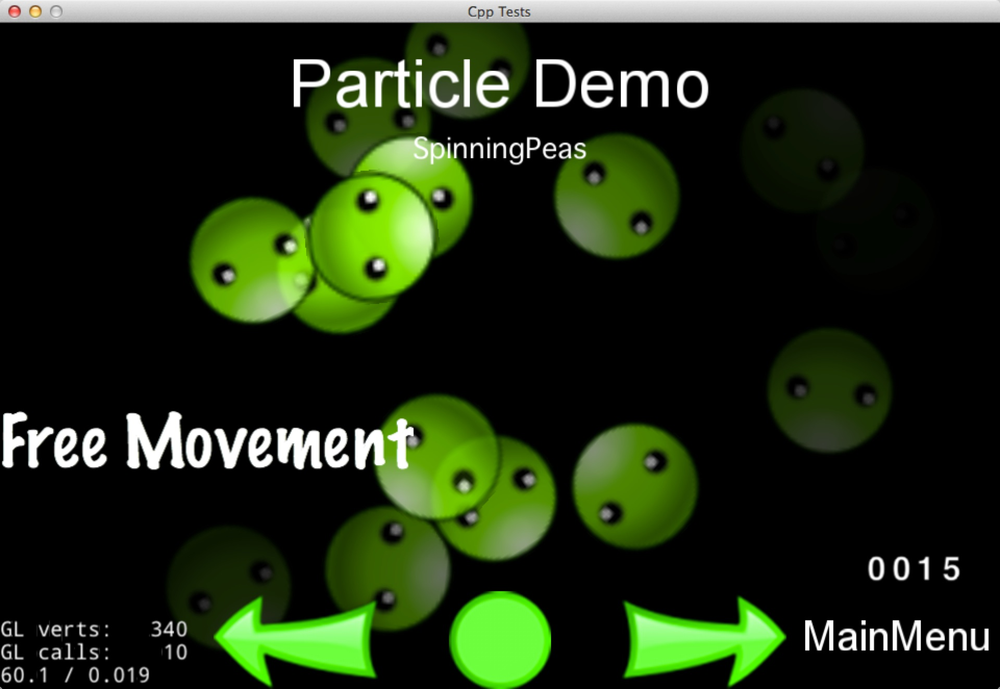
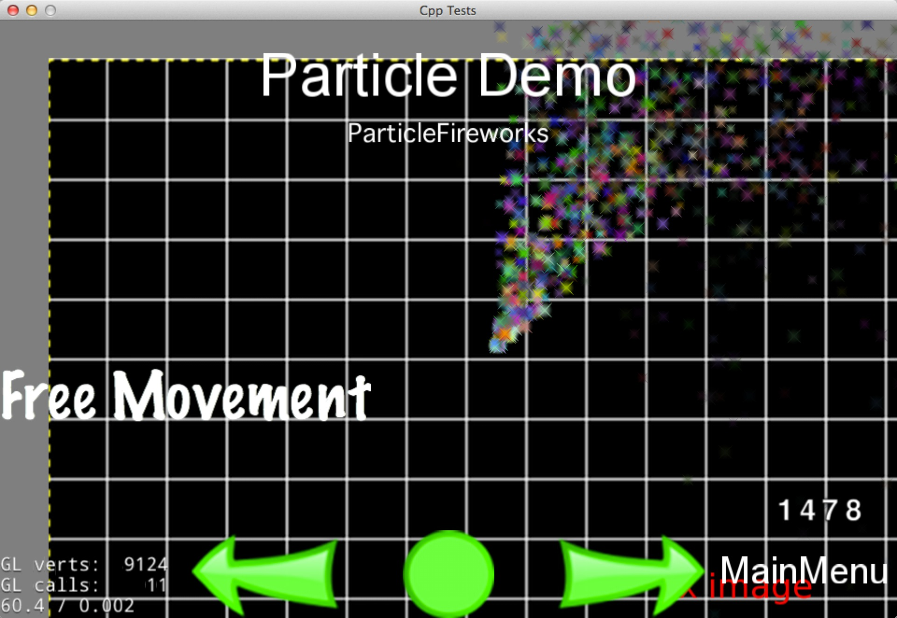
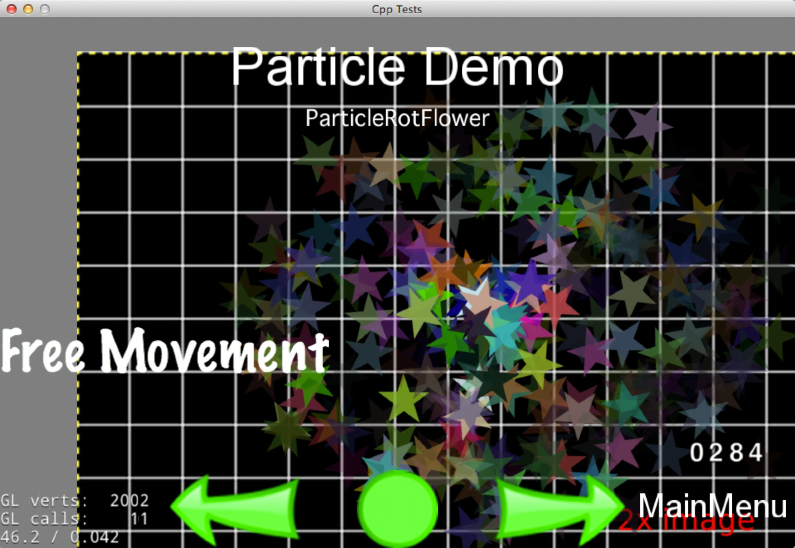

# Chapter 7: Other Node Types

## TMX and Fast TMX
TMX is an XML-based map format originally designed for tile-based maps but
meanwhile also suitable for more generic game levels due to its support
for various object types. Tile-based maps can have many layers, determined by a z-order. Each tile has a unique position and id.

```cpp
// reading in a tiled map.
cocos2d::TMXTiledMap* map = cocos2d::TMXTiledMap::create("TileMap.tmx");
addChild(map, 0, kTagTileMap);

// how to get a specific layer and tile
auto layer = map->layerNamed("Layer 0");
auto tile = layer->tileAt(cocos2d::Vec2(1, 63));

// to obtain a specific tiles id
unsigned int gid = layer->tileGIDAt(cocos2d::Vec2(0, 63));
```
Example Tilemap concepts


## Particle
###What is particle?
The term particle system refers to a computer graphics technique that uses a large number of very small sprites or other graphic objects to simulate certain kinds of “fuzzy” phenomena, which are otherwise very hard to reproduce with conventional rendering techniques - usually highly chaotic systems, natural phenomena, and/or processes caused by chemical reactions.

Example Particle Effects:


`Snow`


`The Sun`

Particle system includes 2 modes and so many properties. To build a particle is a process of setting the mode and properties.

### Common properties of the particles:

-   startSize: Start size of the particles in pixels

-   startSizeVar

-   endSize: Use kCCParticleStartSizeEqualToEndSize if you want that the start size == end size.

-   endSizeVar

-   startColor (a ccColor4F)

-   startColorVar (a ccColor4F)

-   endColor (a ccColor4F)

-   endColorVar (a ccColor4F)

-   startSpin. Only used in ParticleSystemQuad

-   startSpinVar. Only used in ParticleSystemQuad

-   endSpin. Only used in ParticleSystemQuad

-   endSpinVar. Only used in ParticleSystemQuad

-   life: time to live of the particles in seconds

-   lifeVar:

-   angle: (a float). Starting degrees of the particle

-   angleVar

-   positon: (a Point)

-   posVar

-   centerOfGravity (a Point)

### Common properties of the system:

-   emissionRate (a float). How many particle are emitted per second

-   duration (a float). How many seconds does the particle system (different than the life property) lives. Use kCCParticleDurationInfinity for infity.

-   blendFunc (a ccBlendFunc). The OpenGL blending function used for the system

-   positionType (a tCCPositionType). Use kCCPositionTypeFree (default one) for moving particles freely. Or use kCCPositionTypeGrouped to move them in a group.

-   texture (a Texture2D). The texture used for the particles

### Gravity Mode
Gravity Mode lets particles fly toward or away from a center point. Its strength is that it allows very dynamic, organic effects. 


Gravity Mode

#### These properties are only valid in Gravity Mode:

-   gravity (a CGPoint). The gravity of the particle system

-   speed (a float). The speed at which the particles are emitted

-   speedVar (a float). The speed variance.

-   tangencialAccel (a float). The tangential acceleration of the particles.

-   tangencialAccelVar (a float). The tangential acceleration variance.

-   radialAccel (a float). The radial acceleration of the particles.

-   radialAccelVar (a float). The radial acceleration variance.

### Radius Mode

Radius Mode causes particles to rotate in a circle. It also allows you to create spiral effects with particles either rushing inward or orating outward. 


Radius Mode

#### These properties are only valid in Radius Mode:

-   startRadius (a float). The starting radius of the particles

-   startRadiusVar (a float). The starting radius variance

-   endRadius (a float). The ending radius of the particles.

-   endRadiusVar (a float). The ending radius variance

-   rotatePerSecond (a float). Number of degress to rotate a particle around the source pos per second.

-   rotatePerSecondVar (a float). Number of degrees variance.

###How to create your particle?
There are two types of particle system in cocos2d-x: `CCParticleSystem` and `CCParticleSystemQuad`:

-   `CCParticleSystem`

-   `CCParticleSystemQuad`

`CCParticleSystem` extends from  `Node` and `TextureProtocol` in cocos2d-x, which means it shares all of the properties of it's super classes.

The `CCParticleSystemQuad` extends from `CCParticleSystem`. It includes all the features of ParticleSystem. Besides that, it has these additional features that `CCParticleSystem` doesn’t support:

- Particle size can be any float number.
- The system can be scaled
- The particles can be rotated
- It supports subrects
- It supports batched rendering since 1.1

####3 ways to create particles:

1. Create by `plist` file
2. Create by built-in particle examples
3. Create every property by yourselves 

####Create by plist file
A `plist` file may contain all of the informations of a particle. And you can just create a particle system by a `plist` file.

```cpp
//Create by plist file
auto particleSystem = ParticleSystem::create("Particles/SpinningPeas.plist");

//Still you can modify the properties of particle if you need
//examples
// duration
particleSystem->setDuration(ParticleSystem::DURATION_INFINITY);

// radius mode
particleSystem->setEmitterMode(ParticleSystem::Mode::RADIUS);

// radius mode: 100 pixels from center
particleSystem->setStartRadius(100);
particleSystem->setStartRadiusVar(0);
particleSystem->setEndRadius(ParticleSystem::START_RADIUS_EQUAL_TO_END_RADIUS);
particleSystem->setEndRadiusVar(0);    // not used when start == end

// radius mode: degrees per second
// 45 * 4 seconds of life = 180 degrees
particleSystem->setRotatePerSecond(45);
particleSystem->setRotatePerSecondVar(0);
```


Spinning peas

So where can we define the plist file? We have so many particle tools. These tools allow you to new or modify your partilces visually (Like choosing your partilce's mode and you can see the effect in the editor immediately). Most of time, it is the best way to create particles. Here are some recommended tools below:

1. [Particle Designer](https://71squared.com/particledesigner): A very powerful particle effects editor on Mac
2. [V-play particle editor](http://v-play.net/2014/02/v-play-particle-editor-for-cocos2d-and-v-play/): A cross-platform particle editor for cocos2d-x
3. [Particle2dx](http://www.effecthub.com/particle2dx): An online web particle designer

####Create by built-in particle examples
Cocos2d-x comes with some predefined particles that can be customized in runtime. List of predefined particles:

-   ParticleFire: Point particle system. Uses Gravity mode.
-   ParticleFireworks: Point particle system. Uses Gravity mode.
-   ParticleSun: Point particle system. Uses Gravity mode.
-   ParticleGalaxy: Point particle system. Uses Gravity mode.
-   ParticleFlower: Point particle system. Uses Gravity mode.
-   ParticleMeteor: Point particle system. Uses Gravity mode.
-   ParticleSpiral: Point particle system. Uses Gravity mode.
-   ParticleExplosion: Point particle system. Uses Gravity mode.
-   ParticleSmoke: Point particle system. Uses Gravity mode.
-   ParticleSnow: Point particle system. Uses Gravity mode.
-   ParticleRain: Point particle system. Uses Gravity mode.

All of the effects can be found in the `cocos2d-x root/tests/cpp-test/Classes/Classes/ParticleTest/ParticleTest.cpp`.

```cpp
//------------------------------------------------------------------
//
// DemoFirework
//
//------------------------------------------------------------------
void DemoFirework::onEnter()
{
    ParticleDemo::onEnter();

    _emitter = ParticleFireworks::create();
    _emitter->retain();
    _background->addChild(_emitter, 10);

    _emitter->setTexture( Director::getInstance()->getTextureCache()->addImage(s_stars1) );

    setEmitterPosition();
}

std::string DemoFirework::subtitle() const
{
    return "ParticleFireworks";
}
```


Particle Fireworks

####Create every property by yourselves
In this way, you need to set all the properties of a particle.
```cpp
//------------------------------------------------------------------
//
// DemoRotFlower
//
//------------------------------------------------------------------
void DemoRotFlower::onEnter()
{
    ParticleDemo::onEnter();

    _emitter = ParticleSystemQuad::createWithTotalParticles(300);
    _emitter->retain();

    _background->addChild(_emitter, 10);
    ////_emitter->release();    // win32 : Remove this line
    _emitter->setTexture( Director::getInstance()->getTextureCache()->addImage(s_stars2) );

    // duration
    _emitter->setDuration(-1);

    // gravity
    _emitter->setGravity(Vec2::ZERO);

    // angle
    _emitter->setAngle(90);
    _emitter->setAngleVar(360);

    // speed of particles
    _emitter->setSpeed(160);
    _emitter->setSpeedVar(20);

    // radial
    _emitter->setRadialAccel(-120);
    _emitter->setRadialAccelVar(0);

    // tagential
    _emitter->setTangentialAccel(30);
    _emitter->setTangentialAccelVar(0);

    // emitter position
    _emitter->setPosition( Vec2(160,240) );
    _emitter->setPosVar(Vec2::ZERO);

    // life of particles
    _emitter->setLife(3);
    _emitter->setLifeVar(1);

    // spin of particles
    _emitter->setStartSpin(0);
    _emitter->setStartSpinVar(0);
    _emitter->setEndSpin(0);
    _emitter->setEndSpinVar(2000);

    // color of particles
    Color4F startColor(0.5f, 0.5f, 0.5f, 1.0f);
    _emitter->setStartColor(startColor);

    Color4F startColorVar(0.5f, 0.5f, 0.5f, 1.0f);
    _emitter->setStartColorVar(startColorVar);

    Color4F endColor(0.1f, 0.1f, 0.1f, 0.2f);
    _emitter->setEndColor(endColor);

    Color4F endColorVar(0.1f, 0.1f, 0.1f, 0.2f);
    _emitter->setEndColorVar(endColorVar);

    // size, in pixels
    _emitter->setStartSize(30.0f);
    _emitter->setStartSizeVar(00.0f);
    _emitter->setEndSize(ParticleSystem::START_SIZE_EQUAL_TO_END_SIZE);

    // emits per second
    _emitter->setEmissionRate(_emitter->getTotalParticles()/_emitter->getLife());

    // additive
    _emitter->setBlendAdditive(false);

    setEmitterPosition();
}
```



###CCParticleBatchNode

A `CCParticleBatchNode` can reference one and only one texture (one image file, one texture atlas). Only the `CCParticleSystems` that are contained in that texture can be added to the `CCSpriteBatchNode`. All `CCParticleSystems` added to a `CCSpriteBatchNode` are drawn in one OpenGL ES draw call. If the `CCParticleSystems` are not added to a `CCParticleBatchNode `then an OpenGL ES draw call will be needed for each one, which is less efficient.

## Parallax
A `Parallax` Node is a special `Node` type that simulates a parallax scroller. You can think of many games that function this way, Super Mario Bros being a classic example. Parallax Nodes can be moved around by a `Sequence` and also manually by mouse, touch, accelerameter or keyboard events. 

Parallax nodes are a bit more complex than regular nodes. Why? Because they require the use of multiple nodes to function.

An example of adding multiple Nodes to a Parallax node.
```cpp
// create a void node, a parent node
auto voidNode = ParallaxNode::create();
    
// NOW add the 3 nodes to the 'void' node

// background image is moved at a ratio of 0.4x, 0.5y
voidNode->addChild(background, -1, Vec2(0.4f,0.5f), Vec2::ZERO);
    
// tiles are moved at a ratio of 2.2x, 1.0y
voidNode->addChild(tilemap, 1, Vec2(2.2f,1.0f), Vec2(0,-200) );
    
// top image is moved at a ratio of 3.0x, 2.5y
voidNode->addChild(cocosImage, 2, Vec2(3.0f,2.5f), Vec2(200,800) );
```

OK, looks and feels familiar, right? Notice a few items! Each Node is given a unique `z-order` so that they stack on top of each other. Also notice the additional parameters to the `addChild()` call. 

